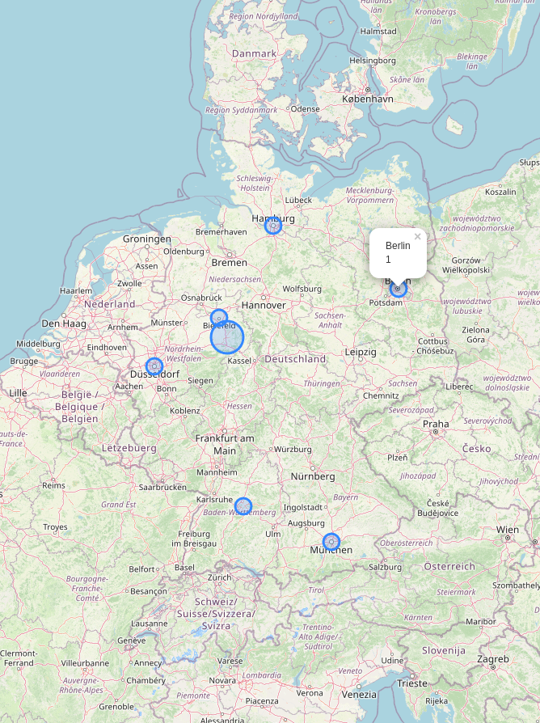

Ignore this Repo

As a result of time constraints and my priorities, this project is limited in scope. I would of cause put more effort into the actual project.

# Ideas for improvements:
1. Surrounding UI
2. List which devices are used.
3. Warnings if suspicious behavior is detected.   This could be logins from a different country/city than usually or a new device.
4. Time slider to filter which data is used in the visualization.
5. Arrows on the map to indicate travel routs.
6. Adapt Circles size to zoom level and combine circles when zoomed out far.
7. List Number of datapoints
8. It might be possible to confront the user with possible characteristics extracted from the data. These could be if they are students (e.g. access with university ip), habits (e.g. check facebook after waking up), wealth (android vs ios, how old are the devices and how many) 
